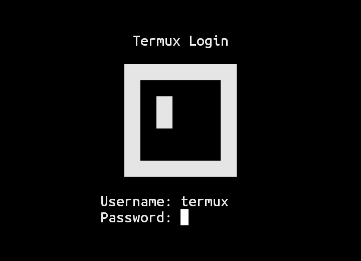

# termux-login
<p align="center">
  
</p>
New script termux-login to make the Termux application more interesting.
## Type a command
```bash
source <(curl -fsSL https://raw.githubusercontent.com/SeifTechnone/termux-login/main/setup.sh)```